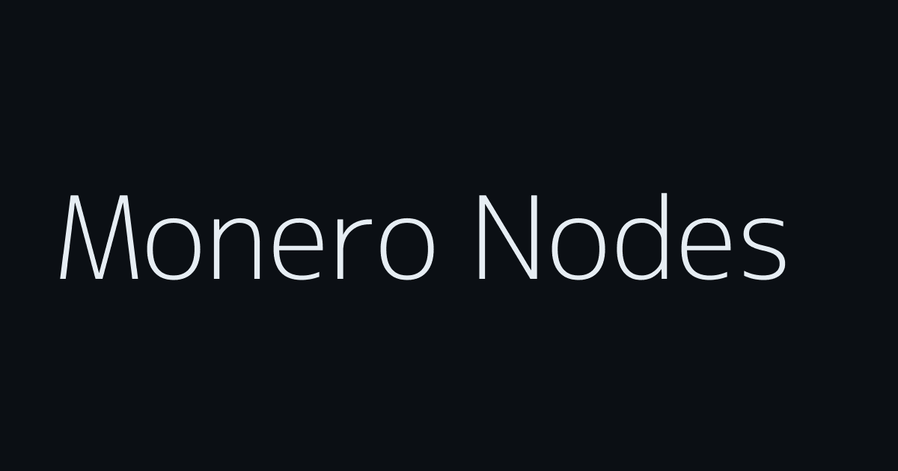

# Monero Public Nodes Dashboard

A lightning-fast, privacy-focused, and mobile-friendly web dashboard for discovering and connecting to active Monero public nodes.

## Overview
This single-page application (SPA) serves as a front-facing directory interface parsing data from community node aggregators. It allows users to quickly view, search, and filter operational Monero RPC endpoints across multiple networks without needing to run their own full node or sift through raw API JSON data.

### Features
- **Multi-Network Support:** Organizes endpoints seamlessly across **Clearnet**, **Tor (Onion)**, and **I2P** network tabs.
- **Search Filtering:** In-browser, instantaneous fuzzy search for node URLs or hosts.
- **Privacy Hygiene Strategy:** Actively excludes direct IP endpoints where possible to heavily encourage host-based routing.
- **Zero Dependencies:** Written purely in Vanilla HTML, CSS, and JS. Zero build tools or frameworks required.
- **Excel-Style Tab Layout:** Distinct workspaces for each network protocol for clean data presentation.
- **Dynamic Pagination:** Easy digestion of massive endpoint datasets limited to 20 rows per visual page.

## Use Case
* **"Why do I need a remote node?"** 
  A remote node allows lightweight wallets (like Cake Wallet, Monerujo, or the GUI wallet in simple mode) to query external Monero blockchain software for validating, dispatching, and syncing transactions. 
  Instead of syncing a massive blockchain locally on your own computer or smartphone, simply copy and paste a Node URL from this list directly into your wallet settings to connect immediately.

*Note: Since node availability is notoriously volatile, this dashboard does not explicitly guarantee node uptime. Always verify endpoint synchronicity natively within your wallet software.*
